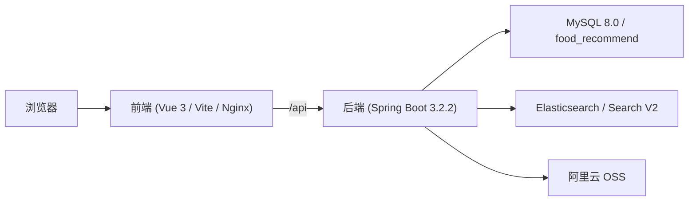

# foodrec 项目交接主文档（agent.md）

> 文档定位：给新工程师和新大模型快速接手 `foodrec` 项目的单文件总入口  
> 适用范围：`F:\Desktop\大创\foodrec` 全仓  
> 最后核对日期：2026-03-20  
> 当前事实来源优先级：**源码 > 本文档 > `docs/` 专题文档 > 根目录 `readme.md`（快速启动入口）**  
> 特别提醒：根目录 [readme.md](./readme.md) 现在已更新为“快速上手入口”，适合本地启动；涉及系统全貌、数据库细节、搜索运行态时，仍应优先以源码和本文档为准

---

## 1. 文档目的与适用范围

这份文档的目标不是替代所有现有文档，而是让一个第一次接手本仓库的人，或者一个第一次进入仓库的大模型，在只读这一份文档的情况下，快速建立以下认知：

1. 这个项目现在到底由哪些系统组成。
2. 前端、管理端、后端、数据库、搜索分别在哪里。
3. 哪些文档是新的，哪些是旧的，应该先信谁。
4. 当前推荐、搜索、埋点、烹饪模式分别做到什么程度。
5. 数据库真实结构是什么，建表语句和索引在哪里。
6. 启动时哪些表、列、索引会被程序自动补齐。
7. 接手后应该从哪里开始读、从哪里开始改。

数据库补丁补充：

- 如果导入的是较旧整库备份，除了备份本体外，还应再执行：
  - `backend/let-me-cook/src/main/resources/db/migration/V6__daily_recommendation_comment_patch.sql`
- 这份补丁会补齐：
  - `daily_recipe_recommendations`
  - `daily_recommend_job_runs`
  - 各属性表 `recipe_count`
  - 评论性能索引与增量触发器

这份文档适用于：

- 新工程师接手项目
- 新大模型第一次进入仓库
- 联调、排障、二次开发、迁移部署前的快速对齐

不适用于：

- 作为接口字段的唯一来源
- 作为数据库运行状态的实时快照
- 替代 `docs/` 中更详细的 API 文档、数据库文档、迭代记录

---

## 2. 一页式项目全景

这是一个已经从“基础菜谱站点”演进到“带推荐、搜索、烹饪辅助、行为埋点、管理后台”的美食推荐系统。

当前系统组成如下：

- **一个前端工程**
  - 同时承载用户端页面和管理后台页面
  - 技术栈：Vue 3 + Vite + Element Plus + Pinia + Axios + ECharts
- **一个后端工程**
  - Spring Boot + MyBatis 注解 SQL + MySQL
  - 提供用户端、管理端、统计、推荐、搜索、上传等 API
- **一个 MySQL 数据库**
  - 核心业务数据、埋点、会话、管理数据、统计汇总都在这里
- **一个 Elasticsearch**
  - 当前 Search V2 已接管搜索主链路
- **一个 OSS 接入层**
  - 负责图片上传；本地默认关闭

当前最重要的几个事实：

- 用户端和管理端**不是两个前端仓库**，都在 `frontend/` 里。
- 根目录 `admin/` 不是实际使用中的独立管理端工程。
- 搜索当前运行态已经是 **Search V2 + Elasticsearch**。
- 推荐页顶部筛选已经从旧的“硬编码场景词”切到“现有分类筛选”。
- 数据库结构不能只看 `schema.sql`，还必须看启动期的 `DatabaseMigrationConfig`。



---

## 3. 5 分钟上手路径

按这个顺序看，最快：

1. **先看第 4 章**
   - 明确真实技术栈、端口、运行组合、搜索开关。
2. **再看第 5、6 章**
   - 搞清楚前端和后端分别从哪里进、目录怎么分、改哪一层。
3. **再看第 7 章**
   - 搞清当前搜索、推荐、埋点、烹饪模式的真实实现状态。
4. **再看第 8、9、10 章**
   - 搞清数据库全貌、完整建表 SQL、索引和运行期迁移补丁。
5. **最后看第 11、12、13 章**
   - 复制常用命令，避开已知坑，再去读更细的专题文档。

如果你是新大模型，推荐第一轮上下文就读这些文件：

- `frontend/src/router/index.js`
- `frontend/src/views/Recommend.vue`
- `backend/let-me-cook/src/main/resources/application.properties`
- `backend/let-me-cook/src/main/java/com/foodrecommend/letmecook/controller/RecipeController.java`
- `backend/let-me-cook/src/main/java/com/foodrecommend/letmecook/service/impl/RecipeServiceImpl.java`
- `backend/let-me-cook/src/main/java/com/foodrecommend/letmecook/config/DatabaseMigrationConfig.java`
- `backend/let-me-cook/src/main/resources/schema.sql`

---

## 4. 当前技术栈与运行拓扑

### 4.1 前端技术栈（以 `frontend/package.json` 为准）

- Vue `^3.4.0`
- Vite `^5.0.0`
- Vue Router `^4.2.5`
- Pinia `^2.1.7`
- Axios `^1.6.0`
- Element Plus `^2.5.0`
- `@element-plus/icons-vue`
- ECharts `^5.4.3`

### 4.2 后端技术栈（以 `backend/let-me-cook/pom.xml` 为准）

- Java 21（代码现状）
- Spring Boot `3.2.2`
- MyBatis Spring Boot Starter `3.0.3`
- MySQL Connector/J
- Spring Cache
- Spring Data Elasticsearch
- JJWT `0.11.5`
- Spring Security Crypto
- Lombok `1.18.38`
- 阿里云 OSS SDK `3.17.2`

### 4.3 当前真实端口与运行口径

截至 `2026-03-19` 当前本地常见组合是：

- 前端：`http://127.0.0.1:5173`
- 后端：`http://127.0.0.1:8081`
- Elasticsearch：`http://127.0.0.1:9200`
- MySQL 数据库：`food_recommend`

当前本地常见运行组合：

- **前端**：Docker 容器对外暴露 `5173`
- **后端**：宿主机直接运行 JAR，监听 `8081`
- **ES**：Docker 容器对外暴露 `9200`

### 4.4 配置层要点

配置文件：`backend/let-me-cook/src/main/resources/application.properties`

关键事实：

- 默认后端端口是 `8081`
- 默认数据库连接是 `jdbc:mysql://localhost:3306/food_recommend`
- 仓库默认 `search.engine=${SEARCH_ENGINE:auto}`
- 仓库默认 ES 地址是 `http://127.0.0.1:9200`
- 仓库默认 OSS 本地关闭：`aliyun.oss.enabled=false`

### 4.5 “仓库默认配置”与“当前运行态”的差异

这个项目有一组非常重要的“默认值 != 当前运行态”的差异：

- **搜索开关**
  - 仓库默认：`search.engine=auto`
  - 当前本地运行态：ES 可用时自动切到 `elasticsearch`
- **前端端口**
  - Vite 默认：`3000`
  - 当前本地常用：`5173`（Docker Nginx）
- **OSS**
  - 本地默认关闭
  - 线上/正式环境可能开启

接手时不要把“仓库默认值”误当成“机器当前实际运行值”。

---

## 5. 前端结构与关键入口

### 5.1 当前前端事实

- 用户端和管理端都在 **同一个** `frontend/` 工程里
- 管理端不是独立部署的 React/Vue 子项目
- 根目录 `admin/` 目录不是当前实际前端入口

### 5.2 前端目录导图

前端根目录：`frontend/src`

| 路径 | 作用 |
|---|---|
| `src/main.js` | 应用入口 |
| `src/App.vue` | 顶层容器 |
| `src/router/index.js` | 所有用户端/管理端路由入口 |
| `src/api/` | 普通用户 API 封装 |
| `src/layout/` | 主站布局，如 `MainLayout.vue` |
| `src/components/` | 通用组件 |
| `src/components/admin/` | 管理端布局与管理端公共组件 |
| `src/views/` | 用户端主页面 |
| `src/views/admin/` | 管理后台页面 |
| `src/views/user/` | 用户中心相关页面 |
| `src/stores/` | Pinia store |
| `src/utils/` | 请求器、埋点、工具函数 |
| `src/styles/` | 全局样式 |

### 5.3 路由结构（当前主入口）

路由文件：`frontend/src/router/index.js`

用户端主路由：

| 路由 | 页面 |
|---|---|
| `/` | 首页 `Home.vue` |
| `/recipes` | 菜谱大全 `Recipes.vue` |
| `/recipe/:id` | 菜谱详情 `RecipeDetail.vue` |
| `/recipe/:id/cook` | 烹饪模式 `CookingMode.vue` |
| `/search` | 搜索页 `Search.vue` |
| `/recommend` | 推荐页 `Recommend.vue` |
| `/create-recipe` | 投稿页 `CreateRecipe.vue` |
| `/user` | 用户中心 `UserCenter.vue` |
| `/user/favorites` | 收藏页 `Favorites.vue` |
| `/user/report` | 用户报告页 `UserReport.vue` |
| `/login` | 用户登录 |
| `/register` | 用户注册 |

管理端主路由：

| 路由 | 页面 |
|---|---|
| `/admin/login` | 管理员登录 |
| `/admin/dashboard` | 数据看板 |
| `/admin/users` | 用户管理 |
| `/admin/recipes` | 食谱管理 |
| `/admin/categories` | 分类管理 |
| `/admin/attributes` | 属性管理 |
| `/admin/logs` | 系统日志 |

### 5.4 前端修改时怎么找入口

如果你要改：

- **普通页面**
  - 先看 `src/router/index.js`
  - 再进对应 `src/views/*.vue`
- **管理页面**
  - 先看 `src/router/index.js`
  - 再进 `src/views/admin/*.vue`
- **请求逻辑**
  - 看 `src/api/`
  - 再看 `src/utils/request.js`
- **推荐页**
  - 重点看 `src/views/Recommend.vue`
- **搜索页**
  - 重点看 `src/views/Search.vue`
- **烹饪模式**
  - 重点看 `src/views/CookingMode.vue`
- **用户报告**
  - 重点看 `src/views/user/UserReport.vue`

### 5.5 当前前端重点事实

- 推荐页顶部现在是 **分类筛选**，不是旧的“场景筛选”
- 推荐页当前精选分类是：
  - `家常菜`
  - `快手菜`
  - `减肥瘦身`
  - `宴客菜`
  - `夜宵`
  - `下饭菜`
  - `儿童`
  - `早餐`
- 如果页面仍显示旧的 `快手 / 减脂 / 一人食 / 家庭餐 ...`
  - 优先检查是不是旧前端容器/旧静态资源
  - 不要先怀疑后端逻辑

---

## 6. 后端结构与关键入口

### 6.1 后端主工程位置

后端根工程：`backend/let-me-cook`

核心入口：

- `src/main/java/com/foodrecommend/letmecook/LetMeCookApplication.java`

### 6.2 后端包结构导图

后端主包：`backend/let-me-cook/src/main/java/com/foodrecommend/letmecook`

| 包 | 作用 |
|---|---|
| `controller` | 用户端、管理端、统计、搜索、埋点、会话接口 |
| `service` | 业务接口、装配器、缓存与服务抽象 |
| `service/impl` | 主要业务实现 |
| `mapper` | MyBatis 注解 SQL；当前没有大规模 XML Mapper |
| `entity` | 实体类 |
| `dto` | 前后端请求/响应 DTO |
| `config` | 启动配置、数据库迁移、搜索配置等 |
| `util` | JWT、场景规则、帮助类 |
| `search` | Search V2 相关模块 |
| `common` | 通用响应结构、分页结果等 |

### 6.3 Controller 职责边界

当前主要控制器按职责可以这样理解：

**用户端业务**

- `UserController`
- `RecipeController`
- `FavoriteController`
- `CommentController`
- `CategoryController`
- `PublicAttributeController`
- `UploadController`

**推荐 / 搜索 / 行为 / 会话**

- `RecipeController`：搜索、推荐、相似菜谱
- `SceneController`：旧场景标签接口（兼容保留）
- `AnalyticsController`：行为埋点
- `CookingSessionController`：烹饪会话
- `UserReportController`：7 日用户报告

**管理端**

- `AdminController`
- `AdminRecipeController`
- `AdminCategoryController`
- `AttributeController`
- `AdminLogController`
- `StatisticsController`
- `AdvancedStatisticsController`
- `AdminSearchController`

### 6.4 Search V2 所在目录

`search/` 目录是当前搜索主链路的重要实现，不属于普通 MyBatis 查询层：

| 文件 | 作用 |
|---|---|
| `RecipeSearchService.java` | ES 搜索查询、建议词、索引写入 |
| `RecipeSearchDataLoader.java` | 从 MySQL 组装 ES 文档 |
| `RecipeSearchDocument.java` | 搜索文档模型 |
| `RecipeSearchReindexService.java` | 全量重建 |
| `RecipeSearchIndexInitializer.java` | 索引初始化 |
| `RecipeSearchSyncEvent.java` | 事务提交后同步事件 |
| `RecipeSearchSyncListener.java` | MySQL 提交后双写 ES |

### 6.5 后端修改时怎么找入口

如果你要改：

- **用户端接口**
  - 先看 `controller`
  - 再看 `service/impl`
  - 最后看 `mapper`
- **推荐**
  - 重点看 `RecipeController` + `RecipeServiceImpl`
- **搜索**
  - 重点看 `RecipeController` + `search/` 目录
- **数据库结构/索引/启动补丁**
  - 重点看 `schema.sql` + `DatabaseMigrationConfig.java`
- **管理端食谱/用户后台**
  - 重点看 `AdminRecipeController` / `AdminRecipeServiceImpl`
  - 以及 `AdminController` / `AdminServiceImpl`

---

## 7. 搜索、推荐、埋点、烹饪模式的现状说明

### 7.1 搜索现状

当前搜索已经是 **Search V2**：

- 使用 Elasticsearch
- 当前索引：`recipes_search_v2`
- 运行态别名：`recipes_search`
- 中文分词：`smartcn`
- 主搜索策略：
  - `combined_fields`
  - `match_phrase`
  - `keyword` 精确提升
- 建议词：
  - `completion suggester`
  - 独立 suggestion 字段，不复用主搜索字段

接口：

- `GET /api/recipes/search`
- `GET /api/recipes/search/suggestions`

重要事实：

- 仓库默认 `search.engine=auto`
- 当前本地运行态已切到 `elasticsearch`

### 7.2 推荐现状

推荐入口：

- `GET /api/recipes/recommend`

推荐类型：

- `type=personal`
- `type=hot`
- `type=new`

当前推荐页顶部筛选已经切换为：

- **现有分类筛选**
- 前端默认走 `categoryId`
- 旧 `scene` 参数仍保留兼容，但前端默认不再使用

当前推荐链路关键行为：

- 个人推荐会先扩大候选池
- 再按分类过滤
- 如果过滤后结果不足，会用该分类热门菜谱补齐

当前还存在一条**离线 Top100 推荐链路**：

- 入口仍复用：
  - `GET /api/recipes/recommend`
- 当前后端行为：
  - 对登录用户，如果 `type=personal` 或 `type=daily`
  - 会先查 `daily_recipe_recommendations`
  - 如果该用户当天存在离线 `Top100`
    - 优先返回这批离线结果
  - 如果不存在
    - 回退现有实时推荐
- 这条离线链路在仓库内保留：
  - `local_top100_cke_full/selected_model_manifest.json`
  - `local_top100_cke_full/README.md`
  - `scripts/recommendation_daily/`
- 大型模型权重、缓存数据和运行工件不随普通 Git 推送
- 当前默认使用的历史最优模型是：
  - `CKEFull`
  - 数据集：`meishitianxia_v1`
  - 模型文件：本地离线 bundle 中的 `model_epoch0030.pt`
- 当前已验证的离线落库结果：
  - 可映射用户 `5460`
  - 每用户 `Top100`
  - 总写入 `546000` 行
  - 每用户前 `16` 条标记为 `selected_for_delivery=1`

要点：

- 前端**当前并没有单独做“今日推荐”页面改造**
- 但对于命中离线结果的用户，现有推荐页的 `personal` 结果已经会优先命中这批 `Top100`
- 当前 `personal` 结果已改成混合模式：
  - 约 `50%` 直接来自离线 `Top100`
  - 约 `50%` 来自实时推荐链路
  - 当用户在推荐页选择分类时，这部分实时推荐会严格按所选分类过滤
  - 两部分结果在返回前会随机打乱顺序
  - 分类筛选下的实时 `50%` 不再走重型个性化重排，而是走轻量分类推荐，优先保证切换分类时的响应速度
- 推荐页分类筛选不再硬编码固定分类，前端改为调用 `GET /api/categories/recommend?limit=10`
- 后端热门分类来源于 `categories.recipe_count`，并走应用缓存，不在请求时对 `recipe_categories` 做全量计数
- 这意味着“后端已适配，前端 UI 仍是旧推荐页形态”

### 7.3 行为埋点与画像现状

当前系统已经有：

- 行为埋点表：`behavior_events`
- 用户偏好画像表：`user_preference_profiles`

当前已落地的能力：

- 页面浏览埋点
- 搜索/推荐埋点
- 冷启动问卷
- 推荐解释
- 用户报告统计

### 7.4 烹饪模式与用户报告现状

已落地：

- 烹饪模式：开始、进度保存、步骤推进、完成、断点恢复
- 用户报告：近 7 日烹饪次数、完成率、偏好分析

相关表：

- `cooking_sessions`
- `behavior_events`

### 7.5 当前最容易误判的点

1. 以为推荐页仍按旧场景词工作  
   实际不是，前端默认已经切为 `categoryId`。

2. 以为搜索仍走 MySQL  
   实际本地运行态已切到 ES。

3. 以为只看 `schema.sql` 就等于数据库现状  
   实际启动还会再补表、补列、补索引、隐藏冗余索引。

---

## 8. 数据库总览

### 8.1 基本信息

- 数据库名：`food_recommend`
- 字符集：`utf8mb4`
- 排序规则：`utf8mb4_unicode_ci`
- 时区：`Asia/Shanghai`
- 关系型数据库：MySQL 8.0

### 8.2 按业务分组的表

**基础映射表**

- `categories`
- `tastes`
- `techniques`
- `time_costs`
- `difficulties`
- `ingredients`
- `cookwares`

**核心业务表**

- `users`
- `recipes`
- `recipe_categories`
- `recipe_ingredients`
- `cooking_steps`
- `comments`
- `interactions`

**行为 / 画像 / 会话**

- `user_preference_profiles`
- `behavior_events`
- `cooking_sessions`

**ID 映射表**

- `user_id_mapping`
- `recipe_id_mapping`

**管理后台表**

- `admins`
- `operation_logs`

**统计汇总表**

- `statistics_overview`
- `user_trend_daily`
- `recipe_trend_daily`
- `comment_trend_daily`
- `category_distribution`
- `difficulty_distribution`
- `top_recipes_hourly`
- `top_commented_recipes_daily`
- `interaction_daily`

### 8.3 数据库现状的两层来源

数据库真实结构要同时看两处：

1. **基础 DDL**
   - `backend/let-me-cook/src/main/resources/schema.sql`
2. **启动期迁移补丁**
   - `backend/let-me-cook/src/main/java/com/foodrecommend/letmecook/config/DatabaseMigrationConfig.java`

只看 `schema.sql` 不够，因为启动期还会：

- 补建表
- 补列
- 补索引
- 隐藏冗余索引
- 可选执行 `ANALYZE TABLE`

---

## 9. 数据库完整建表 SQL

> 说明：以下 SQL 以 `2026-03-19` 当前仓库中的 `backend/let-me-cook/src/main/resources/schema.sql` 为准，按原始结构完整保留，便于直接复制、审阅和喂给大模型。

### 9.1 基础 DDL 与主业务表

```sql
-- 创建数据库
CREATE DATABASE IF NOT EXISTS food_recommend DEFAULT CHARACTER SET utf8mb4 COLLATE utf8mb4_unicode_ci;

USE food_recommend;

-- ===================== 基础映射表 =====================

-- 分类表（热菜、家常菜、私房菜等）
CREATE TABLE IF NOT EXISTS categories (
    id INT PRIMARY KEY AUTO_INCREMENT,
    name VARCHAR(50) NOT NULL UNIQUE,
    create_time DATETIME DEFAULT CURRENT_TIMESTAMP
) ENGINE=InnoDB DEFAULT CHARSET=utf8mb4 COMMENT='菜品分类表';

-- 口味表（原味、咸鲜、甜味等）
CREATE TABLE IF NOT EXISTS tastes (
    id INT PRIMARY KEY AUTO_INCREMENT,
    name VARCHAR(50) NOT NULL UNIQUE,
    create_time DATETIME DEFAULT CURRENT_TIMESTAMP
) ENGINE=InnoDB DEFAULT CHARSET=utf8mb4 COMMENT='口味表';

-- 工艺表（炒、焖、煮、蒸等）
CREATE TABLE IF NOT EXISTS techniques (
    id INT PRIMARY KEY AUTO_INCREMENT,
    name VARCHAR(50) NOT NULL UNIQUE,
    create_time DATETIME DEFAULT CURRENT_TIMESTAMP
) ENGINE=InnoDB DEFAULT CHARSET=utf8mb4 COMMENT='工艺表';

-- 耗时表（廿分钟、一小时等）
CREATE TABLE IF NOT EXISTS time_costs (
    id INT PRIMARY KEY AUTO_INCREMENT,
    name VARCHAR(50) NOT NULL UNIQUE,
    create_time DATETIME DEFAULT CURRENT_TIMESTAMP
) ENGINE=InnoDB DEFAULT CHARSET=utf8mb4 COMMENT='耗时表';

-- 难度表（普通、简单、高级等）
CREATE TABLE IF NOT EXISTS difficulties (
    id INT PRIMARY KEY AUTO_INCREMENT,
    name VARCHAR(50) NOT NULL UNIQUE,
    create_time DATETIME DEFAULT CURRENT_TIMESTAMP
) ENGINE=InnoDB DEFAULT CHARSET=utf8mb4 COMMENT='难度表';

-- 食材表
CREATE TABLE IF NOT EXISTS ingredients (
    id INT PRIMARY KEY AUTO_INCREMENT,
    name VARCHAR(100) NOT NULL UNIQUE,
    create_time DATETIME DEFAULT CURRENT_TIMESTAMP
) ENGINE=InnoDB DEFAULT CHARSET=utf8mb4 COMMENT='食材表';

-- 厨具表
CREATE TABLE IF NOT EXISTS cookwares (
    id INT PRIMARY KEY AUTO_INCREMENT,
    name VARCHAR(50) NOT NULL UNIQUE,
    recipe_count INT DEFAULT 0,
    create_time DATETIME DEFAULT CURRENT_TIMESTAMP
) ENGINE=InnoDB DEFAULT CHARSET=utf8mb4 COMMENT='厨具表';

-- ===================== 核心业务表 =====================

-- 用户表
CREATE TABLE IF NOT EXISTS users (
    id INT PRIMARY KEY AUTO_INCREMENT,
    old_id INT COMMENT '原始用户ID',
    username VARCHAR(100) UNIQUE,
    password VARCHAR(255),
    nickname VARCHAR(100),
    email VARCHAR(100),
    phone VARCHAR(20),
    status TINYINT DEFAULT 1 COMMENT '状态：1-正常 0-禁用',
    avatar VARCHAR(255),
    last_login_time DATETIME,
    create_time DATETIME DEFAULT CURRENT_TIMESTAMP,
    UNIQUE KEY uk_old_id (old_id)
) ENGINE=InnoDB DEFAULT CHARSET=utf8mb4 COMMENT='用户表';

-- 用户冷启动画像表
CREATE TABLE IF NOT EXISTS user_preference_profiles (
    id INT PRIMARY KEY AUTO_INCREMENT,
    user_id INT NOT NULL UNIQUE,
    diet_goal VARCHAR(50) COMMENT '饮食目标',
    cooking_skill VARCHAR(50) COMMENT '烹饪水平',
    time_budget VARCHAR(50) COMMENT '可投入烹饪时长',
    preferred_tastes_json JSON COMMENT '口味偏好',
    taboo_ingredients_json JSON COMMENT '忌口/过敏',
    available_cookwares_json JSON COMMENT '可用厨具',
    preferred_scenes_json JSON COMMENT '场景偏好',
    onboarding_completed TINYINT DEFAULT 0 COMMENT '冷启动问卷是否完成',
    create_time DATETIME DEFAULT CURRENT_TIMESTAMP,
    update_time DATETIME DEFAULT CURRENT_TIMESTAMP ON UPDATE CURRENT_TIMESTAMP,
    FOREIGN KEY (user_id) REFERENCES users(id) ON DELETE CASCADE
) ENGINE=InnoDB DEFAULT CHARSET=utf8mb4 COMMENT='用户偏好画像表';

-- 菜谱表
CREATE TABLE IF NOT EXISTS recipes (
    id INT PRIMARY KEY AUTO_INCREMENT,
    old_id INT COMMENT '原始菜谱ID',
    title VARCHAR(200) NOT NULL,
    author VARCHAR(100),
    author_uid VARCHAR(50),
    description TEXT,
    tips TEXT,
    cookware VARCHAR(200),
    image VARCHAR(255),
    taste_id INT COMMENT '口味ID',
    technique_id INT COMMENT '工艺ID',
    time_cost_id INT COMMENT '耗时ID',
    difficulty_id INT COMMENT '难度ID',
    reply_count INT DEFAULT 0,
    like_count INT DEFAULT 0,
    favorite_count INT DEFAULT 0,
    rating_count INT DEFAULT 0,
    status TINYINT DEFAULT 1 COMMENT '状态：1-正常 0-禁用',
    create_time DATETIME DEFAULT CURRENT_TIMESTAMP,
    update_time DATETIME DEFAULT CURRENT_TIMESTAMP ON UPDATE CURRENT_TIMESTAMP,
    FOREIGN KEY (taste_id) REFERENCES tastes(id),
    FOREIGN KEY (technique_id) REFERENCES techniques(id),
    FOREIGN KEY (time_cost_id) REFERENCES time_costs(id),
    FOREIGN KEY (difficulty_id) REFERENCES difficulties(id),
    UNIQUE KEY uk_old_id (old_id),
    KEY idx_recipe_author_uid (author_uid)
) ENGINE=InnoDB DEFAULT CHARSET=utf8mb4 COMMENT='菜谱表';

-- 菜谱-分类关联表
CREATE TABLE IF NOT EXISTS recipe_categories (
    id INT PRIMARY KEY AUTO_INCREMENT,
    recipe_id INT NOT NULL,
    category_id INT NOT NULL,
    FOREIGN KEY (recipe_id) REFERENCES recipes(id) ON DELETE CASCADE,
    FOREIGN KEY (category_id) REFERENCES categories(id),
    UNIQUE KEY uk_recipe_category (recipe_id, category_id)
) ENGINE=InnoDB DEFAULT CHARSET=utf8mb4 COMMENT='菜谱-分类关联表';

-- 菜谱-食材关联表
CREATE TABLE IF NOT EXISTS recipe_ingredients (
    id INT PRIMARY KEY AUTO_INCREMENT,
    recipe_id INT NOT NULL,
    ingredient_id INT NOT NULL,
    ingredient_type ENUM('main', 'sub', 'seasoning') COMMENT '食材类型：主料/辅料/调料',
    quantity VARCHAR(100) COMMENT '用量',
    FOREIGN KEY (recipe_id) REFERENCES recipes(id) ON DELETE CASCADE,
    FOREIGN KEY (ingredient_id) REFERENCES ingredients(id)
) ENGINE=InnoDB DEFAULT CHARSET=utf8mb4 COMMENT='菜谱-食材关联表';

-- 烹饪步骤表
CREATE TABLE IF NOT EXISTS cooking_steps (
    id INT PRIMARY KEY AUTO_INCREMENT,
    recipe_id INT NOT NULL,
    step_number INT NOT NULL,
    description TEXT NOT NULL,
    image VARCHAR(255),
    FOREIGN KEY (recipe_id) REFERENCES recipes(id) ON DELETE CASCADE
) ENGINE=InnoDB DEFAULT CHARSET=utf8mb4 COMMENT='烹饪步骤表';

-- 评论表
CREATE TABLE IF NOT EXISTS comments (
    id INT PRIMARY KEY AUTO_INCREMENT,
    old_id INT COMMENT '原始评论ID',
    recipe_id INT NOT NULL,
    user_id INT,
    content TEXT,
    publish_time DATETIME,
    likes INT DEFAULT 0,
    is_reply TINYINT DEFAULT 0,
    reply_to_user VARCHAR(100),
    device VARCHAR(50),
    has_picture TINYINT DEFAULT 0,
    create_time DATETIME DEFAULT CURRENT_TIMESTAMP,
    FOREIGN KEY (recipe_id) REFERENCES recipes(id) ON DELETE CASCADE,
    FOREIGN KEY (user_id) REFERENCES users(id)
) ENGINE=InnoDB DEFAULT CHARSET=utf8mb4 COMMENT='评论表';

-- 用户互动表（点赞、收藏等）
CREATE TABLE IF NOT EXISTS interactions (
    id INT PRIMARY KEY AUTO_INCREMENT,
    user_id INT NOT NULL,
    recipe_id INT NOT NULL,
    interaction_type ENUM('like', 'favorite', 'view') NOT NULL,
    create_time DATETIME DEFAULT CURRENT_TIMESTAMP,
    FOREIGN KEY (user_id) REFERENCES users(id) ON DELETE CASCADE,
    FOREIGN KEY (recipe_id) REFERENCES recipes(id) ON DELETE CASCADE
) ENGINE=InnoDB DEFAULT CHARSET=utf8mb4 COMMENT='用户互动表';

-- 行为埋点事件表
CREATE TABLE IF NOT EXISTS behavior_events (
    id BIGINT PRIMARY KEY AUTO_INCREMENT,
    user_id INT NULL,
    session_id VARCHAR(64) NOT NULL,
    recipe_id INT NULL,
    event_type VARCHAR(64) NOT NULL,
    source_page VARCHAR(64) NULL,
    scene_code VARCHAR(32) NULL,
    step_number INT NULL,
    duration_ms INT NULL,
    extra_json JSON NULL,
    create_time DATETIME DEFAULT CURRENT_TIMESTAMP,
    FOREIGN KEY (user_id) REFERENCES users(id) ON DELETE SET NULL,
    FOREIGN KEY (recipe_id) REFERENCES recipes(id) ON DELETE SET NULL
) ENGINE=InnoDB DEFAULT CHARSET=utf8mb4 COMMENT='行为埋点事件表';

-- 烹饪会话表
CREATE TABLE IF NOT EXISTS cooking_sessions (
    id BIGINT PRIMARY KEY AUTO_INCREMENT,
    user_id INT NOT NULL,
    recipe_id INT NOT NULL,
    status VARCHAR(20) NOT NULL DEFAULT 'in_progress' COMMENT 'in_progress/completed',
    current_step INT DEFAULT 1,
    total_steps INT DEFAULT 0,
    duration_ms INT DEFAULT 0 COMMENT '累计停留时长',
    started_at DATETIME DEFAULT CURRENT_TIMESTAMP,
    last_active_time DATETIME DEFAULT CURRENT_TIMESTAMP ON UPDATE CURRENT_TIMESTAMP,
    finished_at DATETIME NULL,
    FOREIGN KEY (user_id) REFERENCES users(id) ON DELETE CASCADE,
    FOREIGN KEY (recipe_id) REFERENCES recipes(id) ON DELETE CASCADE
) ENGINE=InnoDB DEFAULT CHARSET=utf8mb4 COMMENT='用户烹饪会话表';

-- ===================== ID映射表 =====================

-- 用户ID映射表
CREATE TABLE IF NOT EXISTS user_id_mapping (
    id INT PRIMARY KEY AUTO_INCREMENT,
    old_user_id INT NOT NULL,
    new_user_id INT NOT NULL,
    UNIQUE KEY uk_old_user_id (old_user_id),
    FOREIGN KEY (new_user_id) REFERENCES users(id)
) ENGINE=InnoDB DEFAULT CHARSET=utf8mb4 COMMENT='用户ID映射表';

-- 菜谱ID映射表
CREATE TABLE IF NOT EXISTS recipe_id_mapping (
    id INT PRIMARY KEY AUTO_INCREMENT,
    old_recipe_id INT NOT NULL,
    new_recipe_id INT NOT NULL,
    UNIQUE KEY uk_old_recipe_id (old_recipe_id),
    FOREIGN KEY (new_recipe_id) REFERENCES recipes(id)
) ENGINE=InnoDB DEFAULT CHARSET=utf8mb4 COMMENT='菜谱ID映射表';

-- 创建索引优化查询
CREATE INDEX idx_recipe_taste ON recipes(taste_id);
CREATE INDEX idx_recipe_technique ON recipes(technique_id);
CREATE INDEX idx_recipe_difficulty ON recipes(difficulty_id);
CREATE INDEX idx_recipe_like_count ON recipes(like_count DESC);
CREATE INDEX idx_recipe_create_time ON recipes(create_time DESC);
CREATE INDEX idx_recipes_status_create_time ON recipes(status, create_time DESC, id DESC);
CREATE INDEX idx_recipes_status_like_count ON recipes(status, like_count DESC, id DESC);
CREATE INDEX idx_recipes_status_rating_count ON recipes(status, rating_count DESC, id DESC);
CREATE INDEX idx_recipes_admin_create_time ON recipes(create_time DESC, id DESC);
CREATE INDEX idx_comment_recipe ON comments(recipe_id);
CREATE INDEX idx_comment_recipe_publish_time ON comments(recipe_id, publish_time DESC, id DESC);
CREATE INDEX idx_comment_create_time ON comments(create_time DESC);
CREATE INDEX idx_comment_user ON comments(user_id);
CREATE INDEX idx_comment_user_create ON comments(user_id, create_time);
CREATE INDEX idx_interaction_user ON interactions(user_id);
CREATE INDEX idx_interaction_recipe ON interactions(recipe_id);
CREATE INDEX idx_interaction_user_type ON interactions(user_id, interaction_type);
CREATE INDEX idx_interactions_create_time_type ON interactions(create_time DESC, interaction_type);
CREATE INDEX idx_user_create_time ON users(create_time DESC);
CREATE INDEX idx_users_status_create_time ON users(status, create_time DESC, id DESC);
CREATE INDEX idx_user_pref_user ON user_preference_profiles(user_id);
CREATE INDEX idx_behavior_user_time ON behavior_events(user_id, create_time DESC, id DESC, recipe_id);
CREATE INDEX idx_behavior_session_time ON behavior_events(session_id, create_time DESC);
CREATE INDEX idx_behavior_event_time ON behavior_events(event_type, create_time DESC);
CREATE INDEX idx_behavior_recipe_time ON behavior_events(recipe_id, create_time DESC);
CREATE INDEX idx_behavior_user_event_time_recipe ON behavior_events(user_id, event_type, create_time DESC, id DESC, recipe_id);
CREATE INDEX idx_behavior_user_time_scene ON behavior_events(user_id, create_time DESC, scene_code);
CREATE INDEX idx_cook_session_user_status_time ON cooking_sessions(user_id, status, last_active_time DESC);
CREATE INDEX idx_cook_session_recipe_time ON cooking_sessions(recipe_id, started_at DESC);
CREATE INDEX idx_cook_session_user_start_time ON cooking_sessions(user_id, started_at DESC);

-- 菜谱 - 分类关联表索引（优化菜谱大全查询）
CREATE INDEX idx_recipe_categories_composite ON recipe_categories(category_id, recipe_id);
CREATE INDEX idx_recipe_categories_recipe ON recipe_categories(recipe_id, category_id);

-- 菜谱 - 食材关联表索引（优化相关推荐查询）
CREATE INDEX idx_ingredient_recipe_type ON recipe_ingredients(ingredient_type, recipe_id);
CREATE INDEX idx_ingredient_ingredient_id ON recipe_ingredients(ingredient_id);
CREATE INDEX idx_recipe_ingredients_composite ON recipe_ingredients(recipe_id, ingredient_type, ingredient_id);
```

### 9.2 管理后台、统计汇总、初始化与触发器

```sql
-- ===================== 管理后台表 =====================

-- 管理员表
CREATE TABLE IF NOT EXISTS admins (
    id INT PRIMARY KEY AUTO_INCREMENT,
    username VARCHAR(50) NOT NULL UNIQUE,
    password VARCHAR(255) NOT NULL,
    email VARCHAR(100),
    role VARCHAR(20) DEFAULT 'admin',
    status TINYINT DEFAULT 1 COMMENT '状态：1-正常，0-禁用',
    last_login_time DATETIME,
    last_login_ip VARCHAR(50),
    create_time DATETIME DEFAULT CURRENT_TIMESTAMP,
    update_time DATETIME DEFAULT CURRENT_TIMESTAMP ON UPDATE CURRENT_TIMESTAMP
) ENGINE=InnoDB DEFAULT CHARSET=utf8mb4 COMMENT='管理员表';

-- 操作日志表
CREATE TABLE IF NOT EXISTS operation_logs (
    id INT PRIMARY KEY AUTO_INCREMENT,
    admin_id INT,
    action VARCHAR(50) NOT NULL,
    target_type VARCHAR(50),
    target_id INT,
    detail TEXT,
    ip VARCHAR(50),
    create_time DATETIME DEFAULT CURRENT_TIMESTAMP,
    FOREIGN KEY (admin_id) REFERENCES admins(id) ON DELETE SET NULL
) ENGINE=InnoDB DEFAULT CHARSET=utf8mb4 COMMENT='操作日志表';

-- ===================== 统计汇总表 =====================

-- 1. 统计概览汇总表（实时）
CREATE TABLE IF NOT EXISTS `statistics_overview` (
    `id` INT PRIMARY KEY AUTO_INCREMENT,
    `stat_date` DATE NOT NULL COMMENT '统计日期',
    `total_users` INT DEFAULT 0 COMMENT '总用户数',
    `total_recipes` INT DEFAULT 0 COMMENT '总菜谱数',
    `total_categories` INT DEFAULT 0 COMMENT '总分类数',
    `total_comments` INT DEFAULT 0 COMMENT '总评论数',
    `today_views` INT DEFAULT 0 COMMENT '今日浏览数',
    `today_new_users` INT DEFAULT 0 COMMENT '今日新增用户',
    `today_new_recipes` INT DEFAULT 0 COMMENT '今日新增菜谱',
    `create_time` DATETIME DEFAULT CURRENT_TIMESTAMP,
    `update_time` DATETIME DEFAULT CURRENT_TIMESTAMP ON UPDATE CURRENT_TIMESTAMP,
    UNIQUE KEY `uk_stat_date` (`stat_date`)
) ENGINE=InnoDB DEFAULT CHARSET=utf8mb4 COMMENT='统计概览汇总表';

-- 2. 用户趋势表（按天聚合）
CREATE TABLE IF NOT EXISTS `user_trend_daily` (
    `id` INT PRIMARY KEY AUTO_INCREMENT,
    `stat_date` DATE NOT NULL COMMENT '统计日期',
    `new_users_count` INT DEFAULT 0 COMMENT '新增用户数',
    `total_users` INT DEFAULT 0 COMMENT '累计用户数',
    `active_users` INT DEFAULT 0 COMMENT '活跃用户数',
    `create_time` DATETIME DEFAULT CURRENT_TIMESTAMP,
    UNIQUE KEY `uk_stat_date` (`stat_date`)
) ENGINE=InnoDB DEFAULT CHARSET=utf8mb4 COMMENT='用户趋势日报表';

-- 3. 菜谱趋势表（按天聚合）
CREATE TABLE IF NOT EXISTS `recipe_trend_daily` (
    `id` INT PRIMARY KEY AUTO_INCREMENT,
    `stat_date` DATE NOT NULL COMMENT '统计日期',
    `new_recipes_count` INT DEFAULT 0 COMMENT '新增菜谱数',
    `total_recipes` INT DEFAULT 0 COMMENT '累计菜谱数',
    `create_time` DATETIME DEFAULT CURRENT_TIMESTAMP,
    UNIQUE KEY `uk_stat_date` (`stat_date`)
) ENGINE=InnoDB DEFAULT CHARSET=utf8mb4 COMMENT='菜谱趋势日报表';

-- 4. 评论趋势表（按天聚合）
CREATE TABLE IF NOT EXISTS `comment_trend_daily` (
    `id` INT PRIMARY KEY AUTO_INCREMENT,
    `stat_date` DATE NOT NULL COMMENT '统计日期',
    `new_comments_count` INT DEFAULT 0 COMMENT '新增评论数',
    `total_comments` INT DEFAULT 0 COMMENT '累计评论数',
    `create_time` DATETIME DEFAULT CURRENT_TIMESTAMP,
    UNIQUE KEY `uk_stat_date` (`stat_date`)
) ENGINE=InnoDB DEFAULT CHARSET=utf8mb4 COMMENT='评论趋势日报表';

-- 5. 分类分布汇总表（实时）
CREATE TABLE IF NOT EXISTS `category_distribution` (
    `id` INT PRIMARY KEY AUTO_INCREMENT,
    `category_id` INT NOT NULL COMMENT '分类 ID',
    `category_name` VARCHAR(100) NOT NULL COMMENT '分类名称',
    `recipe_count` INT DEFAULT 0 COMMENT '菜谱数量',
    `stat_date` DATE NOT NULL COMMENT '统计日期',
    `create_time` DATETIME DEFAULT CURRENT_TIMESTAMP,
    `update_time` DATETIME DEFAULT CURRENT_TIMESTAMP ON UPDATE CURRENT_TIMESTAMP,
    UNIQUE KEY `uk_category_date` (`category_id`, `stat_date`),
    KEY `idx_recipe_count` (`recipe_count`)
) ENGINE=InnoDB DEFAULT CHARSET=utf8mb4 COMMENT='分类分布汇总表';

-- 6. 难度分布汇总表（实时）
CREATE TABLE IF NOT EXISTS `difficulty_distribution` (
    `id` INT PRIMARY KEY AUTO_INCREMENT,
    `difficulty_id` INT NOT NULL COMMENT '难度 ID',
    `difficulty_name` VARCHAR(50) NOT NULL COMMENT '难度名称',
    `recipe_count` INT DEFAULT 0 COMMENT '菜谱数量',
    `stat_date` DATE NOT NULL COMMENT '统计日期',
    `create_time` DATETIME DEFAULT CURRENT_TIMESTAMP,
    `update_time` DATETIME DEFAULT CURRENT_TIMESTAMP ON UPDATE CURRENT_TIMESTAMP,
    UNIQUE KEY `uk_difficulty_date` (`difficulty_id`, `stat_date`),
    KEY `idx_recipe_count` (`recipe_count`)
) ENGINE=InnoDB DEFAULT CHARSET=utf8mb4 COMMENT='难度分布汇总表';

-- 7. 热门菜谱汇总表（Top 10，每小时更新）
CREATE TABLE IF NOT EXISTS `top_recipes_hourly` (
    `id` INT PRIMARY KEY AUTO_INCREMENT,
    `recipe_id` INT NOT NULL COMMENT '菜谱 ID',
    `recipe_title` VARCHAR(255) NOT NULL COMMENT '菜谱标题',
    `like_count` INT DEFAULT 0 COMMENT '点赞数',
    `view_count` INT DEFAULT 0 COMMENT '浏览数',
    `comment_count` INT DEFAULT 0 COMMENT '评论数',
    `rank` INT NOT NULL COMMENT '排名',
    `stat_hour` DATETIME NOT NULL COMMENT '统计小时',
    `create_time` DATETIME DEFAULT CURRENT_TIMESTAMP,
    UNIQUE KEY `uk_recipe_hour` (`recipe_id`, `stat_hour`),
    KEY `idx_rank` (`rank`),
    KEY `idx_like_count` (`like_count`)
) ENGINE=InnoDB DEFAULT CHARSET=utf8mb4 COMMENT='热门菜谱小时榜';

-- 8. 热门评论菜谱汇总表（Top 10，每天更新）
CREATE TABLE IF NOT EXISTS `top_commented_recipes_daily` (
    `id` INT PRIMARY KEY AUTO_INCREMENT,
    `recipe_id` INT NOT NULL COMMENT '菜谱 ID',
    `recipe_title` VARCHAR(255) NOT NULL COMMENT '菜谱标题',
    `comment_count` INT DEFAULT 0 COMMENT '评论数',
    `rank` INT NOT NULL COMMENT '排名',
    `stat_date` DATE NOT NULL COMMENT '统计日期',
    `create_time` DATETIME DEFAULT CURRENT_TIMESTAMP,
    UNIQUE KEY `uk_recipe_date` (`recipe_id`, `stat_date`),
    KEY `idx_rank` (`rank`),
    KEY `idx_comment_count` (`comment_count`)
) ENGINE=InnoDB DEFAULT CHARSET=utf8mb4 COMMENT='热门评论菜谱日报表';

-- 9. 互动统计表（按天聚合）
CREATE TABLE IF NOT EXISTS `interaction_daily` (
    `id` INT PRIMARY KEY AUTO_INCREMENT,
    `stat_date` DATE NOT NULL COMMENT '统计日期',
    `total_interactions` INT DEFAULT 0 COMMENT '总互动数',
    `favorite_count` INT DEFAULT 0 COMMENT '收藏数',
    `view_count` INT DEFAULT 0 COMMENT '浏览数',
    `create_time` DATETIME DEFAULT CURRENT_TIMESTAMP,
    UNIQUE KEY `uk_stat_date` (`stat_date`),
    KEY `idx_total_interactions` (`total_interactions`)
) ENGINE=InnoDB DEFAULT CHARSET=utf8mb4 COMMENT='互动统计日报表';

-- 初始化统计概览
INSERT IGNORE INTO statistics_overview 
(stat_date, total_users, total_recipes, total_categories, total_comments, today_views, today_new_users, today_new_recipes)
SELECT 
    CURDATE() as stat_date,
    (SELECT COUNT(*) FROM users) as total_users,
    (SELECT COUNT(*) FROM recipes) as total_recipes,
    (SELECT COUNT(*) FROM categories) as total_categories,
    (SELECT COUNT(*) FROM comments) as total_comments,
    (SELECT COUNT(*) FROM interactions WHERE create_time >= CURDATE()) as today_views,
    (SELECT COUNT(*) FROM users WHERE create_time >= CURDATE()) as today_new_users,
    (SELECT COUNT(*) FROM recipes WHERE create_time >= CURDATE()) as today_new_recipes;

-- 初始化分类分布
INSERT IGNORE INTO category_distribution (category_id, category_name, recipe_count, stat_date)
SELECT 
    c.id as category_id,
    c.name as category_name,
    COUNT(rc.recipe_id) as recipe_count,
    CURDATE() as stat_date
FROM categories c
LEFT JOIN recipe_categories rc ON c.id = rc.category_id
GROUP BY c.id, c.name;

-- 初始化难度分布
INSERT IGNORE INTO difficulty_distribution (difficulty_id, difficulty_name, recipe_count, stat_date)
SELECT 
    d.id as difficulty_id,
    d.name as difficulty_name,
    COUNT(r.id) as recipe_count,
    CURDATE() as stat_date
FROM difficulties d
LEFT JOIN recipes r ON d.id = r.difficulty_id
GROUP BY d.id, d.name;

DELIMITER $$

-- 用户新增触发器
CREATE TRIGGER IF NOT EXISTS trg_user_insert AFTER INSERT ON users
FOR EACH ROW
BEGIN
    INSERT INTO statistics_overview (stat_date, total_users, today_new_users)
    VALUES (CURDATE(), (SELECT COUNT(*) FROM users), 1)
    ON DUPLICATE KEY UPDATE
        total_users = total_users + 1,
        today_new_users = today_new_users + 1,
        update_time = NOW();
    
    INSERT INTO user_trend_daily (stat_date, new_users_count, total_users)
    VALUES (CURDATE(), 1, (SELECT COUNT(*) FROM users))
    ON DUPLICATE KEY UPDATE
        new_users_count = new_users_count + 1,
        total_users = VALUES(total_users);
END$$

-- 菜谱新增触发器
CREATE TRIGGER IF NOT EXISTS trg_recipe_insert AFTER INSERT ON recipes
FOR EACH ROW
BEGIN
    INSERT INTO statistics_overview (stat_date, total_recipes, today_new_recipes)
    VALUES (CURDATE(), (SELECT COUNT(*) FROM recipes), 1)
    ON DUPLICATE KEY UPDATE
        total_recipes = total_recipes + 1,
        today_new_recipes = today_new_recipes + 1,
        update_time = NOW();
    
    INSERT INTO recipe_trend_daily (stat_date, new_recipes_count, total_recipes)
    VALUES (CURDATE(), 1, (SELECT COUNT(*) FROM recipes))
    ON DUPLICATE KEY UPDATE
        new_recipes_count = new_recipes_count + 1,
        total_recipes = VALUES(total_recipes);
END$$

-- 评论新增触发器
CREATE TRIGGER IF NOT EXISTS trg_comment_insert AFTER INSERT ON comments
FOR EACH ROW
BEGIN
    INSERT INTO statistics_overview (stat_date, total_comments)
    VALUES (CURDATE(), (SELECT COUNT(*) FROM comments))
    ON DUPLICATE KEY UPDATE
        total_comments = total_comments + 1,
        update_time = NOW();
    
    INSERT INTO comment_trend_daily (stat_date, new_comments_count, total_comments)
    VALUES (CURDATE(), 1, (SELECT COUNT(*) FROM comments))
    ON DUPLICATE KEY UPDATE
        new_comments_count = new_comments_count + 1,
        total_comments = VALUES(total_comments);
END$$

-- 互动新增触发器
CREATE TRIGGER IF NOT EXISTS trg_interaction_insert AFTER INSERT ON interactions
FOR EACH ROW
BEGIN
    INSERT INTO statistics_overview (stat_date, today_views)
    VALUES (CURDATE(), (SELECT COUNT(*) FROM interactions WHERE create_time >= CURDATE()))
    ON DUPLICATE KEY UPDATE
        today_views = today_views + 1,
        update_time = NOW();
    
    INSERT INTO interaction_daily (stat_date, total_interactions, favorite_count, view_count)
    VALUES (
        CURDATE(), 
        1,
        IF(NEW.interaction_type = 'favorite', 1, 0),
        IF(NEW.interaction_type != 'favorite', 1, 0)
    )
    ON DUPLICATE KEY UPDATE
        total_interactions = total_interactions + 1,
        favorite_count = favorite_count + IF(NEW.interaction_type = 'favorite', 1, 0),
        view_count = view_count + IF(NEW.interaction_type != 'favorite', 1, 0);
END$$

DELIMITER ;
```

---

## 10. 索引总览与运行期迁移补充

### 10.1 为什么光看 `schema.sql` 不够

启动类配置 `DatabaseMigrationConfig.java` 会在应用启动时额外执行数据库迁移与性能补丁。

因此真实库现状 = `schema.sql` 基础 DDL + `DatabaseMigrationConfig` 启动期补丁。

### 10.2 启动期会补哪些表/列

如果缺失，启动时会确保这些对象存在：

- `cookwares`
- `user_preference_profiles`
- `behavior_events`
- `cooking_sessions`

此外还会给这些基础表补 `recipe_count` 字段：

- `tastes`
- `techniques`
- `time_costs`
- `difficulties`
- `ingredients`
- `categories`

补列时还会尝试创建对应索引：

- `idx_tastes_recipe_count`
- `idx_techniques_recipe_count`
- `idx_time_costs_recipe_count`
- `idx_difficulties_recipe_count`
- `idx_ingredients_recipe_count`
- `idx_categories_recipe_count`

### 10.3 启动期补建的性能索引

```sql
CREATE INDEX idx_comment_recipe_publish_time ON comments (recipe_id, publish_time DESC, id DESC);
CREATE INDEX idx_comment_create_time ON comments (create_time DESC);
CREATE INDEX idx_comment_user_create ON comments (user_id, create_time);
CREATE INDEX idx_recipes_status_create_time ON recipes (status, create_time DESC, id DESC);
CREATE INDEX idx_recipes_status_like_count ON recipes (status, like_count DESC, id DESC);
CREATE INDEX idx_recipes_status_rating_count ON recipes (status, rating_count DESC, id DESC);
CREATE INDEX idx_recipes_admin_create_time ON recipes (create_time DESC, id DESC);
CREATE INDEX idx_interaction_user_type ON interactions (user_id, interaction_type);
CREATE INDEX idx_interactions_create_time_type ON interactions (create_time DESC, interaction_type);
CREATE INDEX idx_user_create_time ON users (create_time DESC);
CREATE INDEX idx_users_status_create_time ON users (status, create_time DESC, id DESC);
CREATE INDEX idx_recipe_author_uid ON recipes (author_uid);
CREATE INDEX idx_behavior_user_time ON behavior_events (user_id, create_time DESC, id DESC, recipe_id);
CREATE INDEX idx_behavior_event_time ON behavior_events (event_type, create_time DESC);
CREATE INDEX idx_behavior_recipe_time ON behavior_events (recipe_id, create_time DESC);
CREATE INDEX idx_behavior_session_time ON behavior_events (session_id, create_time DESC);
CREATE INDEX idx_behavior_user_event_time_recipe ON behavior_events (user_id, event_type, create_time DESC, id DESC, recipe_id);
CREATE INDEX idx_behavior_user_time_scene ON behavior_events (user_id, create_time DESC, scene_code);
CREATE INDEX idx_cook_session_user_status_time ON cooking_sessions (user_id, status, last_active_time DESC);
CREATE INDEX idx_cook_session_recipe_time ON cooking_sessions (recipe_id, started_at DESC);
CREATE INDEX idx_cook_session_user_start_time ON cooking_sessions (user_id, started_at DESC);
```

### 10.4 启动期增强的日志表

如果 `operation_logs` 已存在，启动时还会增强：

- 补列：
  - `user_agent`
- 补索引：

```sql
CREATE INDEX idx_operation_logs_action ON operation_logs (action);
CREATE INDEX idx_operation_logs_target_type ON operation_logs (target_type);
CREATE INDEX idx_operation_logs_create_time ON operation_logs (create_time DESC);
CREATE INDEX idx_operation_logs_admin_time ON operation_logs (admin_id, create_time DESC);
```

### 10.5 当前已被设为 `INVISIBLE` 的冗余索引

这批索引当前处于观察期隐藏状态，不等于已经删掉：

```sql
ALTER TABLE comments ALTER INDEX idx_comment_recipe INVISIBLE;
ALTER TABLE recipes ALTER INDEX idx_createtime INVISIBLE;
ALTER TABLE recipes ALTER INDEX idx_like_count INVISIBLE;
ALTER TABLE users ALTER INDEX idx_users_status INVISIBLE;
ALTER TABLE users ALTER INDEX idx_user_status INVISIBLE;
ALTER TABLE recipe_categories ALTER INDEX idx_recipe_categories_recipe INVISIBLE;
ALTER TABLE recipe_ingredients ALTER INDEX idx_ri INVISIBLE;
```

### 10.6 当前数据库层面的真实注意事项

1. `recipe_ingredients` 存在历史重复数据  
   这不是索引问题，而是数据质量问题；当前统计层通过 `COUNT(DISTINCT recipe_id)` 绕开了一部分偏差。

2. 启动时默认不跑 `ANALYZE TABLE`  
   配置项：`database.migration.analyze-on-startup=false`

3. 统计读取优先汇总表  
   管理端仪表盘多数读取的是汇总表，不是原始明细表实时聚合。

---

## 11. 常用启动 / 构建 / 排障命令

### 11.1 前端

```powershell
cd F:\Desktop\大创\foodrec\frontend
npm install
npm run dev
```

构建：

```powershell
cd F:\Desktop\大创\foodrec\frontend
npm run build
```

### 11.2 后端

编译：

```powershell
cd F:\Desktop\大创\foodrec\backend\let-me-cook
mvn -q -DskipTests compile
```

打包（当前更稳的本地方式）：

```powershell
cd F:\Desktop\大创\foodrec\backend\let-me-cook
mvn --% -q -Dmaven.test.skip=true package
```

本地直接运行 JAR：

```powershell
cd F:\Desktop\大创\foodrec\backend\let-me-cook
java -jar target\let-me-cook-0.0.1-SNAPSHOT.jar --server.port=8081 --SEARCH_ENGINE=elasticsearch --ALIYUN_OSS_ENABLED=false
```

### 11.3 Docker

重建前端：

```powershell
cd F:\Desktop\大创\foodrec
docker compose build frontend
docker rm -f food-frontend
docker compose up -d --build --no-deps frontend
```

查看容器：

```powershell
docker ps
```

### 11.4 Elasticsearch

查看集群健康：

```powershell
Invoke-WebRequest -UseBasicParsing http://127.0.0.1:9200/_cluster/health
```

### 11.5 后端接口烟测

```powershell
Invoke-WebRequest -UseBasicParsing http://127.0.0.1:8081/api/categories
Invoke-WebRequest -UseBasicParsing "http://127.0.0.1:8081/api/recipes/recommend?type=personal&limit=12&categoryId=42"
Invoke-WebRequest -UseBasicParsing "http://127.0.0.1:8081/api/recipes/search?keyword=草鱼&sort=relevance&page=1&pageSize=12"
```

### 11.6 常见日志位置

- 后端日志：`temp/backend-dev.log`
- 后端错误日志：`temp/backend-dev.err.log`
- 前端日志：`temp/frontend-dev.log`

---

## 12. 当前风险、坑点、接手建议

### 12.1 当前已知风险 / 技术债

1. **根目录 `readme.md` 只负责快速启动，不覆盖全量现状**  
   启动步骤可以信它，但复杂架构、数据库细节、运行态差异仍以源码和本文档为准。

2. **测试代码有一部分滞后于实现**
   - 当前有一些测试仍引用旧 Mapper / 旧服务方法
   - 所以 `mvn package` 常用的是跳过测试编译的方式

3. **`recipe_ingredients` 历史重复数据未清洗**
   - 会影响统计、推荐解释、食材展示的纯净度

4. **前端很容易出现“镜像已更新但容器仍是旧的”**
   - 只 `build` 不删旧容器时，`5173` 可能继续展示旧页面

5. **当前数据库里有 `INVISIBLE` 索引**
   - 它们不是删除，只是隐藏观察期
   - 做索引判断时要注意不要误删

6. **搜索运行态与仓库默认配置不同**
   - 当前默认配置已改成 `auto`
   - 启动时优先检测 Elasticsearch，读索引就绪就自动使用 ES
   - 若 ES 不可用或 alias 未就绪，则自动回退 MySQL
   - 当前本地常用运行态已是 `elasticsearch`

7. **离线 Top100 不是覆盖全部当前用户**
   - 当前入库的是历史 `CKEFull` 数据集里能映射回当前库的 `5460` 个用户
   - 不是当前任意登录用户都能命中离线推荐
   - 没命中的用户会正常回退到实时推荐
8. **推荐页 `猜你喜欢` 已改成混合链路**
   - 命中离线 `Top100` 的用户：结果按 `50% 离线 + 50% 实时` 组装
   - 两部分在返回前整体打乱顺序
   - 用户选择分类时，实时 `50%` 严格按该分类筛选
   - 该实时分类部分使用“分类热门候选池 ID 缓存 + 每次随机抽样详情”，多次点击同一分类结果会变化，且不需要每次重跑重 SQL
9. **首页推荐已与推荐页口径对齐**
   - 首页 `为你推荐` 直接调用 `type=personal`
   - 首页不再对 `为你推荐/热门菜谱` 做 session 缓存
   - 首页 `热门菜谱` 从热门候选池随机抽样展示
   - 首页 `热门分类` 直接读取 `/api/categories/recommend?limit=8`
10. **评论提交链路已做性能修复**
   - 菜谱详情页发表评论后，会先把新评论立即插到本地列表首位，再后台静默刷新
   - `POST /api/comments` 现在直接返回完整评论对象，前端不再等二次拉评论列表才显示成功
   - `comments` 表触发器 `trg_comment_insert` 已从“整表 `COUNT(*)`”改成统计表增量 `+1`
   - 当前本地实测评论提交耗时约 `45ms~200ms`

### 12.2 接手后优先检查的 5 件事

1. 确认你当前访问的是哪套前端：
   - Vite 开发服务还是 Docker Nginx
2. 确认后端 `8081` 是不是宿主机 JAR 在跑
3. 确认搜索当前走 MySQL 还是 ES
4. 确认推荐页顶部是不是“分类筛选”
5. 确认数据库迁移启动日志有没有跑完

### 12.3 给新大模型的推荐首轮提示

把下面这段改成你自己的任务再发给模型，效果会比“直接上来改代码”稳定很多：

```text
你现在接手的是 F:\Desktop\大创\foodrec。
先不要写代码，先阅读：
1. agent.md
2. frontend/src/router/index.js
3. frontend/src/views/Recommend.vue
4. backend/let-me-cook/src/main/resources/application.properties
5. backend/let-me-cook/src/main/java/com/foodrecommend/letmecook/controller/RecipeController.java
6. backend/let-me-cook/src/main/java/com/foodrecommend/letmecook/service/impl/RecipeServiceImpl.java
7. backend/let-me-cook/src/main/java/com/foodrecommend/letmecook/config/DatabaseMigrationConfig.java
8. backend/let-me-cook/src/main/resources/schema.sql

读完后先输出：
- 当前前端/后端/数据库/搜索的结构摘要
- 这次任务会改到哪些文件
- 是否会影响推荐、搜索、管理后台、数据库索引
然后再开始实现。
```

---

## 13. 现有专题文档索引与阅读建议

这份 `agent.md` 是主入口，细节继续看这些文档：

| 文档 | 适合什么时候看 |
|---|---|
| `docs/README.md` | 看文档导航与当前注意事项 |
| `docs/02-开发文档/项目全景开发手册.md` | 需要更长篇的系统讲解时 |
| `docs/02-开发文档/升级迭代记录.md` | 追最近几轮改了什么 |
| `docs/03-API/API 接口文档.md` | 查用户端接口 |
| `docs/03-API/管理员 API 接口文档.md` | 查管理端接口 |
| `docs/05-数据库文档/数据库设计文档.md` | 查数据库专题说明 |
| `SERVER_DEPLOY.md` | 看部署方案 |

推荐阅读顺序：

1. 先读本文档  
2. 再读 `项目全景开发手册.md`  
3. 然后按任务类型去看 API / 数据库 / 迭代记录  
4. 如需本地启动命令，再回头看根目录 `readme.md` 与 `快速启动指南.md`

---

## 附：一句话总结这个项目

这是一个**单前端工程 + 单后端工程 + MySQL + Elasticsearch** 的美食推荐系统；当前搜索已切到 **Search V2 / ES**，推荐页顶部已切到**现有分类筛选**，数据库真实结构需要同时看 **`schema.sql` + `DatabaseMigrationConfig`**，接手时最容易踩的坑是**旧前端容器、数据库运行期补丁，以及把快速启动文档误当成全量架构文档**。
