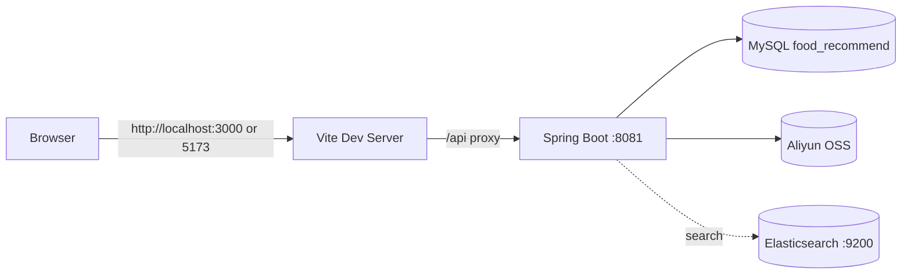

# 项目全景开发手册（超详细）

> 文档定位：后续开发者的一站式项目全景手册（以代码现状为准）  
> 适用范围：`F:\Desktop\大创\foodrec` 全仓  
> 最后核对日期：2026-03-19  
> 维护要求：代码/数据库/API变更后，必须同步更新本手册与相关专题文档

---

## 0. 文档使用说明

### 0.1 先读这个，再读什么

1. 先读本手册第 1、2、3 章，掌握架构与启动链路。
2. 开发后端功能时，重点看第 4、6、8 章。
3. 开发前端功能时，重点看第 5、8 章。
4. 排查线上/联调问题时，优先看第 3、7、8 章。

### 0.2 本手册的“现状”定义

- 以当前仓库代码实现为准，不以历史说明文档为准。
- 对于存在“多套命名/多版本实现”的区域，会显式标注“现状 + 风险 + 建议”。

---

## 1. 项目定位与系统全景

### 1.1 业务定位

美食推荐系统，当前已经从“基础菜谱站点”演进到“带推荐、烹饪辅助和用户行为闭环”的版本，包含一套用户前端、一套管理前端入口和一套后端服务：

- 用户端：
  - 菜谱浏览、搜索、推荐、收藏、评论、投稿菜谱
  - Search V2：中文分词、搜索建议词、最近搜索、多字段混合搜索排序
  - 冷启动问卷、场景化推荐、可解释推荐
  - 烹饪模式、断点续做、7 日用户报告
- 管理端：
  - 用户管理、食谱管理、分类管理、属性管理、日志管理、统计看板
- 后端：
  - 统一 API 服务，负责鉴权、业务逻辑、MySQL 数据访问、统计聚合、行为埋点、OSS 图片上传

### 1.2 技术栈（代码现状）

- 后端
  - Java 21
  - Spring Boot 3.2.2
  - MyBatis（注解 SQL）
  - MySQL 8.0
  - Spring Data Elasticsearch（Search V2，`smartcn + combined_fields + completion`，仓库默认开关仍为 MySQL）
  - JWT（`jjwt 0.11.5`）
  - Lombok 1.18.38
- 前端
  - Vue 3（组合式 API）
  - Vite 5
  - Element Plus
  - Pinia
  - Axios
  - ECharts
- 资源服务
  - 阿里云 OSS（图片上传）
  - Elasticsearch（Search V2 搜索索引，当前本地运行态已启用）

### 1.3 运行拓扑

- 前端开发服务：
  - 默认：`http://localhost:3000`
  - 若通过命令显式指定端口（如 `5173`），以实际启动端口为准
- 后端 API：`http://localhost:8081`
- 前端通过 Vite 代理 `/api` 到后端
- 搜索服务：
  - 当前仓库默认 `search.engine=mysql`
  - 本地当前已完成首轮建索引、V2 重建与切流，运行中别名 `recipes_search -> recipes_search_v2`

---

## 2. 仓库结构与职责

### 2.1 根目录结构（重点）

- `backend/`
  - Spring Boot 主服务在 `backend/let-me-cook/`
- `frontend/`
  - Vue 3 前端（用户端 + 管理端路由都在这里）
- `admin/`
  - 当前为空目录，不是独立管理端项目
- `dataset/`
  - 原始数据集与映射 CSV/JSON
- `scripts/`
  - 数据修复/图片 URL 迁移脚本
- `docs/`
  - 项目文档中心
- `数据库修改相关操作/`
  - 数据库改动记录、SQL 片段、约束说明
- `temp/`
  - 临时脚本与运行日志（例如 `backend-dev.log`、`backend-jar.log`、`frontend-dev.log`）

### 2.2 后端包分层（当前重点）

`backend/let-me-cook/src/main/java/com/foodrecommend/letmecook`

- `controller`
  - 用户端、管理端、统计、行为埋点、场景标签、烹饪会话、用户报告
- `service` / `service/impl`
  - 菜谱、用户、收藏、评论、统计、埋点、烹饪会话、报告
- `mapper`
  - 100% 注解 SQL，负责业务表与统计汇总表访问
- `entity`
  - 业务实体 + 统计实体 + 新增行为/画像/会话实体
- `dto`
  - 用户侧请求/响应 DTO，包括问卷、推荐解释、烹饪会话、7 日报告
- `dto/admin`
  - 管理端 DTO
- `config`
  - Web 配置、拦截器、数据库迁移、OSS、MyBatis、搜索配置
- `common` / `util`
  - 统一响应、分页、鉴权助手、场景标签解析
- `search`
  - 搜索文档、索引初始化、ES 查询、双写同步、全量重建

### 2.3 前端分层（当前重点）

`frontend/src`

- `views/`
  - 首页、菜谱列表、详情、搜索、推荐、投稿、烹饪模式
- `views/user/`
  - 个人中心、收藏、7 日报告
- `views/admin/`
  - 管理登录、仪表盘、用户/菜谱/分类/属性/日志管理
- `components/`
  - 菜谱卡片、冷启动问卷弹窗、复用搜索组件等
- `api/`
  - 用户端和管理端接口封装
- `stores/`
  - `user.js`、`recipe.js`
- `utils/`
  - 请求器、行为埋点追踪器、搜索历史工具

---

## 3. 启动链路与请求链路

### 3.1 本地启动（推荐流程）

1. 启动 MySQL 并确保存在 `food_recommend` 库。
2. 启动后端：
   - 目录：`backend/let-me-cook`
   - 命令：`mvn spring-boot:run`
   - 说明：本地默认 `aliyun.oss.enabled=false`，无需额外 OSS 环境变量即可启动
3. 如需验证 Elasticsearch 搜索：
   - 先启动 ES（例如使用根目录 `docker-compose.yml` 中的 `elasticsearch` 服务，会构建带 `analysis-smartcn` 插件的镜像）
   - 首次建议保持 `SEARCH_ENGINE=mysql`，先完成建索引与全量重建
   - 完成后再将 `search.engine` 或环境变量 `SEARCH_ENGINE` 切换为 `elasticsearch`
4. 启动前端：
   - 目录：`frontend`
   - 命令：`npm install`（首次）+ `npm run dev`
5. 访问：
   - 默认用户端：`http://localhost:3000`
   - 默认管理端：`http://localhost:3000/admin/login`
   - 若前端以 `--port 5173` 启动，则改为对应 `5173` 地址

### 3.2 关键配置与端口

- 后端端口：`backend/let-me-cook/src/main/resources/application.properties`
  - `server.port=8081`
  - `aliyun.oss.enabled=false`（默认关闭 OSS；需显式启用并配置密钥）
  - `statistics.advanced.refresh-on-startup=true`
  - `statistics.advanced.initial-delay-ms=300000`
  - `database.migration.analyze-on-startup=false`
  - `search.engine=mysql`
  - `spring.elasticsearch.uris=http://127.0.0.1:9200`
  - `search.es.index-alias=recipes_search`
  - `search.es.index-name=recipes_search_v2`
  - `search.es.batch-size=500`
  - `search.es.auto-create-index=true`
- 前端端口与代理：`frontend/vite.config.js`
  - `server.port=3000`
  - `/api -> http://localhost:8081`

### 3.3 用户请求完整链路（示例：菜谱列表）

1. 页面调用 `recipeApi.getList()`（`frontend/src/api/index.js`）。
2. 统一请求器 `request.js` 处理 token 与错误（`frontend/src/utils/request.js`）。
3. 请求到后端 `GET /api/recipes`（`RecipeController`）。
4. `RecipeServiceImpl` 组装筛选逻辑并调用 `RecipeMapper.findByCondition`。
5. MyBatis 注解 SQL 执行，返回 DTO。
6. `Result.success` 包装为统一响应：`{ code, message, data }`。

### 3.4 管理请求完整链路（示例：用户管理列表）

1. 页面调用 `adminUserApi.getList()`（`frontend/src/api/admin.js`）。
2. `request.js` 检测 `/admin` 前缀，附加 `admin_token`。
3. 后端 `AdminAuthInterceptor` 先执行。
4. `AdminController.getUsers` -> `AdminServiceImpl.getUsers` -> `AdminUserMapper.findUsers`。
5. 结果封装为分页结构返回。

### 3.5 鉴权链路

- 路由层（前端）
  - `requiresAuth` 依赖 `localStorage.token`
  - `requiresAdminAuth` 依赖 `localStorage.admin_token`
- 接口层（前端）
  - `/admin*` 自动带 `admin_token`
  - 非 `/admin*` 自动带 `token`
- 后端拦截器
  - `AdminAuthInterceptor`：拦截 `/api/admin/**`（排除 `/api/admin/login`）
  - `UserAuthInterceptor`：拦截 `/api/users/**`, `/api/comments/**`, `/api/favorites/**`

---

## 4. 后端深度拆解

## 4.1 启动入口与全局能力

文件：`LetMeCookApplication.java`

- `@SpringBootApplication`
- `@EnableCaching`
- `@EnableScheduling`

说明：应用启动后会启用缓存和定时任务体系。

## 4.2 配置层

### 4.2.1 `WebConfig`

职责：

- CORS 放开 `/api/**`，允许所有来源与常见方法。
- 注册管理员与用户拦截器。

### 4.2.2 `MyBatisConfig`

- `@MapperScan("com.foodrecommend.letmecook.mapper")`
- Mapper 全是注解 SQL，无 XML 文件。

### 4.2.3 `DatabaseMigrationConfig`

启动时执行 `CommandLineRunner`：

- 检查并创建 `cookwares` 表
- 检查并创建 `user_preference_profiles`、`behavior_events`、`cooking_sessions`
- 给多张属性表补 `recipe_count` 字段
- 初始化属性食谱计数
- 增加若干性能索引
- 默认跳过 `ANALYZE TABLE`（可通过配置显式开启）

注意：这是“应用启动时在线改库”的实现，非标准 Flyway/Liquibase 流程。

### 4.2.4 `OssConfig`

- 读取 OSS 配置并创建 `OSS` 客户端 Bean。

### 4.2.5 `SearchProperties` / 搜索基础设施

- `SearchProperties`
  - 统一绑定 `search.engine` 与 `search.es.*` 配置。
- `RecipeSearchIndexInitializer`
  - 启动时检查 ES 索引与别名是否可用，不自动触发全量重建。
- `RecipeSearchService`
  - 负责 Search V2 的 ES 搜索、建议词、单条 upsert/delete、批量写入。
  - 当前查询策略：
    - 核心召回：`combined_fields(title, ingredients, categories, author)` + `operator=and`
    - 精排：`keyword` 精确命中与 `match_phrase`
    - 回退：仅当核心召回为空时，再查询 `tasteName/techniqueName/timeCostName/difficultyName`
  - 当前建议词策略：
    - `titleSuggest`
    - `ingredientSuggest`
    - `categorySuggest`
    - `authorSuggest`
- `RecipeSearchReindexService`
  - 负责版本化全量重建任务状态、互斥锁、后台异步执行与 alias 切换。

## 4.3 统一响应与异常

- 响应结构：`Result<T>`
- 全局异常：`GlobalExceptionHandler`
  - `RuntimeException` 统一转 `code=500`（HTTP 200）
  - 其他异常返回 500

## 4.4 Controller 模块划分

### 4.4.1 用户侧接口

- `RecipeController` (`/api/recipes`)
  - 列表、详情、搜索、推荐、相似、创建
- `CategoryController` (`/api/categories`)
  - 分类列表
- `PublicAttributeController` (`/api/tastes|techniques|time-costs|difficulties|ingredients|cookwares`)
  - 公共属性查询
- `UserController` (`/api/users`)
  - 登录、注册、个人信息查询/更新、冷启动问卷
- `FavoriteController` (`/api/favorites`)
  - 收藏列表、增删、检查
- `CommentController` (`/api/comments`)
  - 评论列表、发表评论、点赞
- `AnalyticsController` (`/api/analytics`)
  - 行为埋点批量写入
- `SceneController` (`/api/scenes`)
  - 场景标签字典
- `CookingSessionController` (`/api/users/cooking-sessions`)
  - 开始烹饪、保存进度、完成会话
- `UserReportController` (`/api/users/reports`)
  - 近 7 日用户烹饪报告
- `UploadController` (`/api/upload`)
  - 图片上传/删除

### 4.4.2 管理侧接口

- `AdminController` (`/api/admin`)
  - 登录、管理员资料、改密、退出、用户管理
- `AdminLogController` (`/api/admin/logs`)
  - 操作日志分页查询
- `AdminRecipeController` (`/api/admin/recipes`)
  - 食谱管理 CRUD + 审核 + 批量删除
- `AdminCategoryController` (`/api/admin/categories`)
  - 分类管理 CRUD
- `AttributeController` (`/api/admin/*`)
  - 口味/技法/耗时/难度/食材/厨具管理
- `StatisticsController` (`/api/admin/statistics`)
  - 概览、用户/食谱/评论统计
- `AdvancedStatisticsController` (`/api/admin/statistics`)
  - 高级统计、分布、月度趋势、手动刷新
- `AdminSearchController` (`/api/admin/search/index`)
  - 搜索索引状态、手动重建

## 4.5 Service 层关键业务规则

### 4.5.1 `RecipeServiceImpl`

- 菜谱列表支持分类/难度/耗时/排序筛选。
- 支持缓存：`recipe_list`, `categories`, `recommendations`, `similar_recipes`。
- 支持场景标签补全与可解释推荐理由输出。
- 推荐页已从硬编码场景切换为“基于现有分类的筛选”，当前前端展示 `家常菜 / 快手菜 / 减肥瘦身 / 宴客菜 / 夜宵 / 下饭菜 / 儿童 / 早餐` 这些真实分类。
- 当用户在推荐页手动选择分类后，个人推荐链路会先扩大候选池，再按分类过滤并用该分类热门结果补齐，避免出现有效分类却空列表。
- 旧版 `scene` 参数仍保留兼容，减脂场景规则已修复“混入糖醋排骨等重口菜”的问题。
- 搜索支持多字段混合检索、建议词聚合与 `relevance/hot/new` 排序。
- 搜索当前支持 `mysql` / `elasticsearch` 双引擎切换：
  - `mysql`：保留原有 MyBatis 多字段混合搜索
  - `elasticsearch`：使用 Search V2 查询策略先查 ES，再按命中顺序回 MySQL 组装列表 DTO
- 当前 Search V2 已解决“`草鱼` 命中 `鱼腥草`”这类中文单字误召回问题。
- 新建菜谱支持“属性与分类按名称自动创建”。
- 用户投稿创建成功后会发布搜索同步事件，在事务提交后执行 ES `upsert`。
- 收藏数字段映射使用 `rating_count` 作为 `favoriteCount`。
- 列表、推荐、相似菜谱链路已补充作者字段透传。

### 4.5.2 `AdminRecipeServiceImpl`

- 管理侧食谱 CRUD，包含食材、步骤、分类关联处理。
- 删除食谱时联动删除关联表数据。
- 创建、更新、删除、批量删除、审核后会发布搜索同步事件。
- 管理端“浏览量”显示映射 `rating_count`。

### 4.5.3 `UserServiceImpl`

- 登录/注册使用 BCrypt 密码校验和加密。
- 支持用户状态禁用校验（`status=0`）。

### 4.5.4 `FavoriteServiceImpl`

- 收藏本质是往 `interactions` 写 `interaction_type='favorite'`。
- 同时更新 `recipes.rating_count`。

- `BehaviorEventService`
  - 行为事件批量写入 `behavior_events`
  - 当前主要事件包括页面浏览、菜谱点击、问卷提交、烹饪模式行为

- `CookingSessionService`
  - 负责烹饪会话的开始、进度保存、完成与断点恢复

- `UserReportService`
  - 负责汇总近 7 日烹饪次数、完成率、场景偏好、活跃时段与建议文本

### 4.5.5 `AdminServiceImpl`

- 管理员登录来源表：`admins`。
- 管理员统计优先读汇总表，缺失时降级读原始统计 SQL。
- 已移除启动时强制重置 `admin` 密码逻辑（2026-03-08 已完成）。

### 4.5.6 统计刷新服务

- `StatisticsRefreshService`：每小时刷新统计，每日清理旧数据。
- `StatisticsRefreshScheduler`：已下线（移除 Bean 注册，避免与 `StatisticsRefreshService` 重复执行）。

## 4.6 Mapper 层现状

- 100% 注解 SQL（`@Select/@Insert/@Update/@Delete`）。
- `application.properties` 仍配置 `mybatis.mapper-locations=classpath:mapper/*.xml`，但当前无 mapper xml。
- 统计相关 Mapper 已统一到同一套字段与表命名（见第 6 章）。

## 4.7 认证与安全实现现状

- JWT 当前包含 `userId`、`tokenType`（`user/admin`）以及可选 `role` claim。
- `AdminAuthInterceptor` 使用管理员 token 校验，并基于 `admins` 表校验账号状态。
- `UserAuthInterceptor` 使用用户 token 校验，并基于 `users` 表校验账号状态。
- 管理员退出接口会将当前 bearer token 加入黑名单。
- Token 黑名单仍是内存 `ConcurrentHashMap` 集合，服务重启即丢失（待后续持久化）。
- `application.properties` 已将 OSS 密钥改为环境变量，并支持 `JWT_SECRET`、`DB_PASSWORD` 覆盖默认值。

## 4.8 OSS 上传链路

- `UploadController` -> `OssUploadService` -> OSS SDK
- 默认通过 `aliyun.oss.enabled=false` 关闭；启用需设置 `ALIYUN_OSS_ENABLED=true` 及 OSS 密钥环境变量
- 支持随机文件名和按 `recipeId` 命名两种上传方式
- 返回公网 URL：`https://{bucket}.{endpoint}/images/{file}`

---

## 5. 前端深度拆解

## 5.1 前端运行与构建

- 开发：`npm run dev`（Vite 3000）
- 打包：`npm run build`
- 预览：`npm run preview`

## 5.2 路由体系

文件：`frontend/src/router/index.js`

### 5.2.1 用户侧路由

- `/` 首页
- `/recipes` 菜谱大全
- `/recipe/:id` 详情
- `/search` 搜索
- `/recommend` 推荐
- `/create-recipe` 投稿（需要用户登录）
- `/user` 用户中心（需要用户登录）
- `/user/favorites` 我的收藏（需要用户登录）
- `/login`、`/register`

### 5.2.2 管理侧路由

- `/admin/login`
- `/admin/dashboard`
- `/admin/users`
- `/admin/recipes`
- `/admin/categories`
- `/admin/attributes`
- `/admin/logs`

说明：管理端是同一个前端项目内的子路由，不是独立 `admin/` 项目。

## 5.3 API 封装层

### 5.3.1 `src/api/index.js`

用户 API：

- `recipeApi`
  - 已包含搜索建议词接口封装 `getSearchSuggestions`
- `userApi`
- `favoriteApi`
- `commentApi`
- `attributeApi`（公开只读属性接口）
- `uploadApi`

### 5.3.2 `src/api/admin.js`

管理 API：

- `adminApi`
- `adminUserApi`
- `adminRecipeApi`
- `adminCategoryApi`
- `adminStatisticsApi`
- `adminLogApi`
- 属性管理 API（taste/technique/timeCost/difficulty/ingredient）

## 5.4 请求器与错误处理

文件：`src/utils/request.js`

- `baseURL=/api`
- 默认 `timeout=15000`
- 请求拦截：
  - `/admin*` 附加 `admin_token`
  - 其他附加 `token`
- 响应拦截：
  - `code != 200` 统一报错
  - HTTP 401 时清理 token 并重定向登录页
  - 支持 `silentError`，用于推荐等弱依赖接口静默降级

## 5.5 主要页面职责

### 5.5.1 用户页面

- `Home.vue`：首页、热门分类、推荐、热门列表
- `Recipes.vue`：筛选+分页列表
- `RecipeDetail.vue`：详情、收藏、评论、相关推荐
- `CookingMode.vue`：步骤推进、自动保存、断点续做、完成收尾
- `Search.vue`：搜索工作台，支持建议词、最近搜索、排序、错误态与空结果态
- `Recommend.vue`：个人/热门/最新推荐标签
- `CreateRecipe.vue`：投稿菜谱（多段表单）
- `user/UserCenter.vue`：个人资料编辑
- `user/Favorites.vue`：收藏列表
- `user/UserReport.vue`：7 日烹饪报告
- `OnboardingSurveyDialog.vue`：登录后冷启动偏好问卷弹窗

### 5.5.2 管理页面

- `admin/Login.vue`：管理登录
- `admin/Dashboard.vue`：概览卡片 + 统计图表 + 高级统计 + 搜索索引卡片
  - 搜索索引卡片当前额外展示 `targetIndex` 与 `phase`
- `admin/UserManagement.vue`：用户 CRUD/状态/重置密码/批量删除
- `admin/RecipeManagement.vue`：食谱 CRUD + 属性关联编辑 + 图片上传
- `admin/CategoryManagement.vue`：分类 CRUD
- `admin/AttributeManagement.vue`：多类型属性管理
- `admin/SystemLogs.vue`：系统日志页（已对接 `/api/admin/logs`）

## 5.6 状态管理

- `stores/user.js`
  - 登录、注册、拉取用户资料、退出
- `stores/recipe.js`
  - 分类缓存、当前菜谱详情

---

## 6. 数据库与统计体系

## 6.1 业务核心表（代码依赖）

- 基础维表：`categories`, `tastes`, `techniques`, `time_costs`, `difficulties`, `ingredients`, `cookwares`
- 主业务表：`users`, `recipes`, `comments`, `interactions`
- 关联表：`recipe_categories`, `recipe_ingredients`, `cooking_steps`
- 用户画像/行为表：`user_preference_profiles`, `behavior_events`, `cooking_sessions`
- 管理表：`admins`, `operation_logs`
- 映射表：`user_id_mapping`, `recipe_id_mapping`

## 6.2 统计汇总体系（已统一）

### 6.2.1 当前主用统计表（步骤 3 后）

- `statistics_overview`
- `user_trend_daily`
- `recipe_trend_daily`
- `comment_trend_daily`
- `category_distribution_summary`
- `difficulty_distribution_summary`
- `top_recipes_hourly`（`stat_time`, `recipe_rank`）
- `top_commented_recipes_hourly`（`stat_time`, `recipe_rank`）

### 6.2.2 兼容说明

- 历史表 `category_distribution`、`difficulty_distribution`、`top_commented_recipes_daily` 可能仍存在于库中。
- 当前业务读写与定时刷新统一使用上面的主用统计表，旧表不再作为主链路依赖。

## 6.3 数据初始化与迁移机制

- `spring.sql.init.mode=never`，默认不自动跑 `schema.sql/data.sql`。
- 未引入 Flyway 依赖，`db/migration/*.sql` 默认不会自动执行。
- 真实迁移由 `DatabaseMigrationConfig` 在应用启动时执行部分 DDL/DML。

## 6.4 数据集资产

目录：`dataset/`

- `菜谱RAW.csv`（约 104MB）
- `评论RAW.csv`（约 341MB）
- `recipes_raw.json`（约 613MB）
- `interactions.csv`（约 143MB）
- `用户ID映射关系.csv`
- `菜谱ID映射关系.csv`

用途：用于构建/修复历史数据、ID 映射、图片 URL 补齐。

## 6.5 脚本资产（`scripts/`）

- `add_image_column.py`：给 recipes 增加 image 列并用 CSV 回填
- `fix_image_column.py`：扩容 image 列并回填
- `fix_image_by_title.py`：按标题匹配修复 image
- `update_images_to_oss.py`：将图片 URL 改为 OSS 格式

注意：脚本使用硬编码本地 DB 凭据与绝对路径，执行前需先审阅。

---

## 7. 本地开发、调试、打包与部署流程

## 7.1 本地开发环境建议

- JDK 21
- Maven 3.9+
- Node.js 18+
- MySQL 8.0

## 7.2 开发前准备

1. 确认 MySQL 用户与库配置与 `application.properties` 一致。
2. 若是新库，先手工执行基础建表和数据初始化脚本。
3. 启动后端，观察启动日志是否执行了 `DatabaseMigrationConfig`。
4. 启动前端，确认 `http://localhost:3000` 可访问。

## 7.3 联调排查顺序（建议固定）

1. 路由是否命中（前端）
2. 请求 URL/方法/参数是否正确（前端 API 封装）
3. token 是否正确注入（请求拦截器）
4. 后端拦截器是否放行
5. Controller -> Service -> Mapper 调用链
6. SQL 执行日志与数据表结构是否匹配

## 7.4 打包流程

- 前端：`npm run build`
- 后端：`mvn clean package -DskipTests`
- 后端 jar：`target/let-me-cook-0.0.1-SNAPSHOT.jar`

## 7.5 部署文档现状

仓库存在 `DEPLOYMENT_PLAN.md` 与 `backend/let-me-cook/DEPLOYMENT_GUIDE.md`，但其中部分文件路径和脚本引用已过时或缺失，部署前需重新核对。

---

## 8. 已知问题与风险清单（优先级）

## 8.1 P0（已清零，2026-03-08）

- 当前无剩余 P0 风险项。

### 8.1.1 P0 已完成项（2026-03-08）

1. 管理鉴权越权风险（已修复）
   - JWT 已区分 `user/admin` token，并加入 `tokenType` claim（管理员 token 可携带 `role`）。
   - `AdminAuthInterceptor` 已切换为 `admins` 表校验，拒绝非管理员 token。

2. 启动即重置管理员密码（已修复）
   - 已移除 `AdminServiceImpl` 中的启动重置逻辑。

3. 明文 OSS 凭据在配置文件中（已修复）
   - OSS `accessKeyId/accessKeySecret` 改为环境变量读取。
   - `jwt.secret` 与数据库密码也支持环境变量覆盖。

4. 用户投稿页依赖管理端属性接口（已修复，步骤 2）
   - `CreateRecipe.vue` 的 `attributeApi` 已切换到公开只读属性接口（`/api/tastes` 等）。
   - 不再依赖 `admin_token` 才能加载投稿属性选项。

## 8.2 P1（高优先级）

1. 收藏/浏览字段语义混用
   - 多处将 `rating_count` 映射为 `favoriteCount` 或 `viewCount`。

2. token 黑名单持久化缺失
   - 仅内存存储，服务重启后失效。

### 8.2.1 P1 已完成项（2026-03-08，步骤 2）

1. 系统日志功能前后端闭环（已修复）
   - 已补齐后端 `/api/admin/logs` 接口，支持分页与筛选。
   - 日志查询统一到 `operation_logs`（联表 `admins` 输出管理员名称）。

2. 统计体系统一（已修复，步骤 3）
   - 统计 Mapper 统一到 `*_summary` + `stat_time/recipe_rank` 命名方案。
   - 仅保留 `StatisticsRefreshService` 定时刷新；重复调度器已下线。
   - 已验证管理端统计接口（overview/users/recipes/comments/advanced）可正常返回。

## 8.3 P2（中优先级）

1. `mybatis.mapper-locations` 指向 XML，但项目无 XML Mapper。
2. 部分测试代码与实现不一致
   - `UserServiceTest` 使用 MD5 预期，但生产实现是 BCrypt。
3. `Favorites.vue` 传分页参数，但 `favoriteApi.getList` 未接收参数。
4. 文档存在历史信息与现状不一致（版本、端口、脚本名）。
5. `schema.sql` 触发器 `CREATE TRIGGER IF NOT EXISTS` 与 MySQL 兼容性需核对。

---

## 9. 建议的修复路线（可执行）

### 阶段 1：安全收敛（P0，已完成 2026-03-08）

1. ✅ JWT 已区分 user/admin token（`tokenType`），并支持管理员 `role` claim。
2. ✅ `AdminAuthInterceptor` 已改为校验管理员 token + `admins` 表状态。
3. ✅ `UserAuthInterceptor` 与用户侧控制器已统一使用用户 token 强校验。
4. ✅ 已删除 `@PostConstruct` 强制重置管理员密码逻辑。
5. ✅ OSS 密钥已迁移到环境变量，JWT 密钥和数据库密码支持环境变量覆盖。

### 阶段 2：接口契约统一（P1，已完成 2026-03-08）

1. ✅ 已补齐 `/api/admin/logs` 后端实现，并统一日志查询到 `operation_logs`。
2. ✅ 已将用户投稿页属性接口改为用户可访问的公开只读路径。
3. ✅ 已清理前后端 API 命名不一致项（`adminCategoryApi.getList` -> `/api/admin/categories`）。

### 阶段 3：统计体系统一（P1，已完成 2026-03-08）

1. ✅ 统计链路统一到 `*_summary` 与 `stat_time/recipe_rank` 字段方案。
2. ✅ 统一 `StatisticsSummaryMapper` 读写语义，修复 DML 注解与字段映射。
3. ✅ 下线重复调度器，仅保留 `StatisticsRefreshService`。

### 阶段 4：质量与可维护性（P2）

1. 修复单测并补充核心业务测试。
2. 清理废弃配置和失效文档。
3. 抽象统一的权限与操作日志基础设施。

---

## 10. 新开发者 1 天上手清单

### 第 1 小时

1. 跑通前后端与数据库。
2. 浏览用户端与管理端关键页面。
3. 阅读本手册第 1、2、3 章。

### 第 2-4 小时

1. 从浏览器网络面板跟一条请求（用户侧 + 管理侧）。
2. 对照 Controller/Service/Mapper 找到对应代码。
3. 理解 `request.js` 与两个后端拦截器。

### 第 5-8 小时

1. 选择一个小功能完成端到端修改。
2. 同步更新 API 文档与本手册相关章节。
3. 在 `文档更新日志.md` 记录改动。

---

## 11. 关键文件索引

## 11.1 后端关键文件

- 入口：`backend/let-me-cook/src/main/java/com/foodrecommend/letmecook/LetMeCookApplication.java`
- 全局配置：`backend/let-me-cook/src/main/resources/application.properties`
- 拦截器配置：`backend/let-me-cook/src/main/java/com/foodrecommend/letmecook/config/WebConfig.java`
- 管理鉴权：`backend/let-me-cook/src/main/java/com/foodrecommend/letmecook/config/AdminAuthInterceptor.java`
- 用户鉴权：`backend/let-me-cook/src/main/java/com/foodrecommend/letmecook/config/UserAuthInterceptor.java`
- 统计刷新服务：`backend/let-me-cook/src/main/java/com/foodrecommend/letmecook/service/StatisticsRefreshService.java`
- 统计校准任务：`backend/let-me-cook/src/main/java/com/foodrecommend/letmecook/scheduler/StatisticsRefreshScheduler.java`
- 管理核心服务：`backend/let-me-cook/src/main/java/com/foodrecommend/letmecook/service/impl/AdminServiceImpl.java`
- 菜谱核心服务：`backend/let-me-cook/src/main/java/com/foodrecommend/letmecook/service/impl/RecipeServiceImpl.java`
- 统计 Mapper：`backend/let-me-cook/src/main/java/com/foodrecommend/letmecook/mapper/StatisticsMapper.java`
- 统计汇总 Mapper：`backend/let-me-cook/src/main/java/com/foodrecommend/letmecook/mapper/StatisticsSummaryMapper.java`

## 11.2 前端关键文件

- 路由：`frontend/src/router/index.js`
- 请求器：`frontend/src/utils/request.js`
- 用户 API：`frontend/src/api/index.js`
- 管理 API：`frontend/src/api/admin.js`
- 管理布局：`frontend/src/components/admin/AdminLayout.vue`
- 管理仪表盘：`frontend/src/views/admin/Dashboard.vue`
- 投稿页：`frontend/src/views/CreateRecipe.vue`

## 11.3 数据库与脚本

- 主结构：`backend/let-me-cook/src/main/resources/schema.sql`
- 示例数据：`backend/let-me-cook/src/main/resources/data.sql`
- 统计迁移：`backend/let-me-cook/src/main/resources/db/migration/*.sql`
- 数据库改动记录：`数据库修改相关操作/修改记录.log`
- 图片数据脚本：`scripts/*.py`

---

## 12. 维护约定（必须执行）

1. 改代码必须同步更新文档（API、数据库、开发手册）。
2. 涉及表结构变更，必须同步更新：
   - SQL 脚本
   - 相关 Mapper/Entity
   - 本手册第 6 章
3. 涉及接口变更，必须同步更新：
   - 前端 API 封装
   - 接口文档
   - 本手册第 4/5/8 章
4. 每次变更后，在 `文档更新日志.md` 增加记录条目。

---

> 本手册目标不是替代代码，而是把“理解代码的路径”和“高风险区域”前置。  
> 后续功能开发请优先基于第 8 章风险清单排优先级。

---

## 附录 A：2026-03-19 SQL 优化落地现状

### A.1 本轮优化范围

- 只做效率优化，不做历史重复数据清洗。
- 优先级按“用户核心链路 -> 管理端分页 -> 埋点/报告 -> 原始统计回退查询”推进。
- MySQL 搜索 fallback 未作为重点对象，搜索主链路仍以 Elasticsearch 为准。

### A.2 已落地的关键优化

1. 评论列表
   - `CommentMapper.findByRecipeId` 已改为 `publish_time DESC, id DESC`
   - 当前依赖索引：`idx_comment_recipe_publish_time`
   - 旧索引 `idx_comment_recipe` 已切为 `INVISIBLE`

2. 用户端菜谱列表
   - `RecipeMapper.findByCondition/countByCondition` 已改为按 `difficulty_id / time_cost_id` 过滤
   - 不再为了筛选条件去驱动 `difficulties/time_costs` 维表
   - 当前依赖索引：
     - `idx_recipes_status_create_time`
     - `idx_recipes_status_like_count`
     - `idx_recipes_status_rating_count`

3. 管理端用户列表
   - `AdminUserMapper` 已改成两段式分页：
     - 第一段只查当页用户 ID
     - 第二段回填基础信息、收藏数、评论数
   - 当前依赖索引：`idx_users_status_create_time`

4. 管理端食谱管理页
   - `AdminRecipeServiceImpl.getRecipes()` 已改成“两段式分页装配”：
     - 第一段仅从 `recipes` 主表分页取 `id`
     - 第二段按 `id IN (...)` 回表补齐难度、口味、技法、耗时等展示字段
   - `categoryId` 条件改为 `EXISTS`，避免分页前的大范围关联排序
   - 前端 `RecipeManagement.vue` 首屏只加载筛选栏所需的 `difficulties/tastes`
   - 编辑弹窗依赖的 `techniques/timeCosts/ingredients/categories` 改为打开弹窗时懒加载并缓存
   - 当前依赖索引：`idx_recipes_admin_create_time`

5. 用户报告与埋点
   - 最近行为菜谱已改成“最近事件取样 + 服务层去重”
   - 当前依赖索引：
     - `idx_behavior_user_time`
     - `idx_behavior_user_event_time_recipe`
     - `idx_behavior_user_time_scene`

6. 统计与高级统计
   - `StatisticsMapper` 的“今日新增/浏览”已改为范围查询
   - `AdvancedStatisticsService.getActiveUsers()` 已优先读汇总表
   - `AdvancedStatisticsMapper.getTopIngredients()` 已用 `COUNT(DISTINCT recipe_id)` 去除重复关系放大

### A.3 当前索引治理策略

- 本轮策略是“先加索引，再隐藏冗余索引，不直接删除”。
- 当前已切换为 `INVISIBLE` 的索引：
  - `comments.idx_comment_recipe`
  - `recipes.idx_createtime`
  - `recipes.idx_like_count`
  - `users.idx_users_status`
  - `users.idx_user_status`
  - `recipe_categories.idx_recipe_categories_recipe`
  - `recipe_ingredients.idx_ri`

### A.4 验证结果（2026-03-19 本地）

- `EXPLAIN` 已确认：
  - 评论列表命中 `idx_comment_recipe_publish_time`，不再 `Using filesort`
  - 菜谱列表 `sort=new` 命中 `idx_recipes_status_create_time`
  - 管理端用户分页命中 `idx_users_status_create_time`
  - 管理端食谱管理分页命中 `idx_recipes_admin_create_time`
  - 最近行为菜谱取样命中 `idx_behavior_user_time`
  - `countTodayViews()` 命中 `idx_interactions_create_time_type`
- 接口冒烟：
  - `GET /api/categories` 返回 `200`
  - `GET /api/recipes?page=1&pageSize=12&sort=new` 返回 `200`
  - `GET /api/comments/recipe/{id}` 返回 `200`
  - `GET /admin/recipes` 返回 `200`
  - `GET /api/admin/users?page=1&pageSize=10&status=1` 返回 `200`
- 当前本地抽样：
  - `GET /api/admin/recipes?page=1&pageSize=10` 约 `176ms`
  - 食谱管理页首屏筛选选项加载约 `23ms`

### A.5 尚未在本轮处理的内容

- `recipe_ingredients` 历史重复数据清洗
- 聚合型报表查询的彻底重写
- MySQL 搜索 fallback 的深度优化
- `INVISIBLE` 索引观察期结束后的正式 `DROP`
